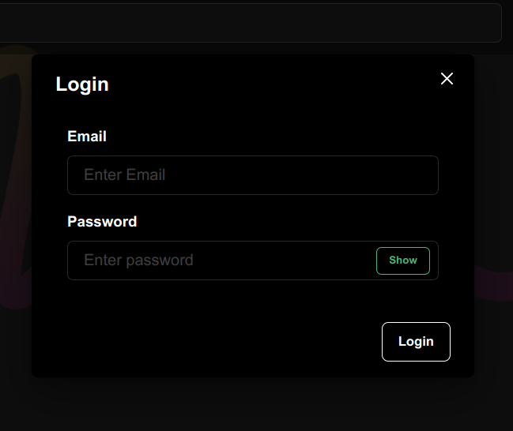
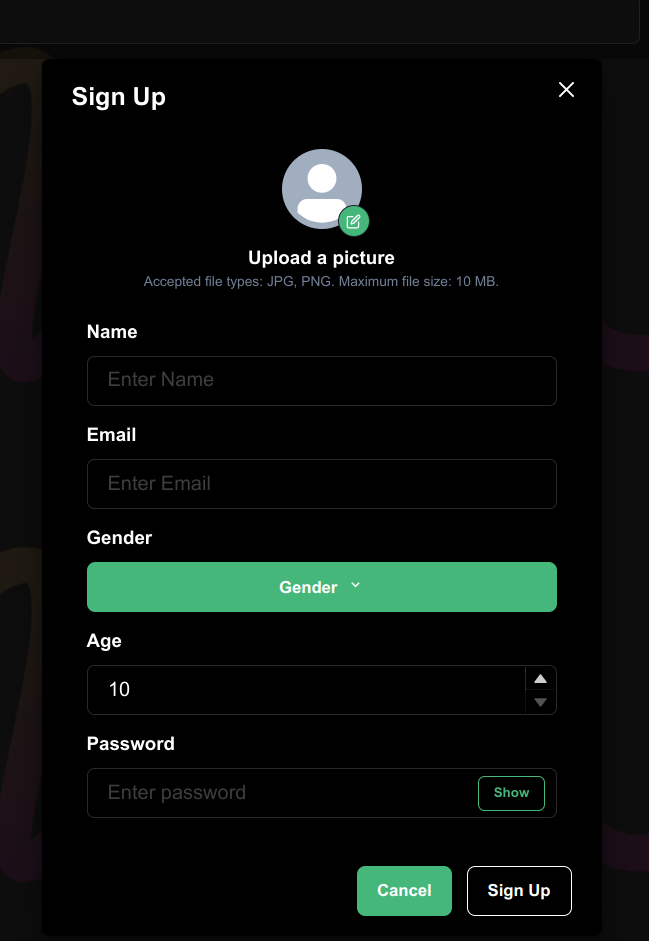
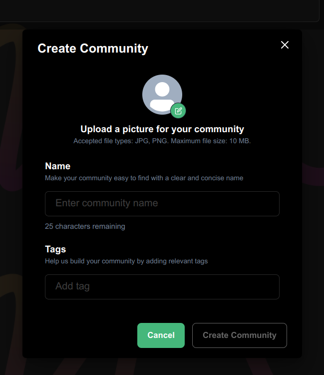

## Table Of Contents
- [Login Module](#1-login-module)
- [SignUp Module](#2-signup-module)
- [Home Page](#3-home-page)
- [Communities Module](#4-communities-module)
     - [Create a Community](#41-create-a-community)
- [Posts Module](#5-comments-module)
- [Comments Module](#6-comments-module)
- [User Profile](#7-user-profile)
- [Logout](#8-logout)

# Main Features
## 1. LOGIN MODULE

A component that allows users to log in to the website by verifying their identity. It is a part of the authentication process that requires users to enter their username and password to gain access to the platform.


The login module works by verifying the user's credentials against a database or directory of authorized users. If the user's credentials are correct, the login module grants access to the system or website, and the user is given appropriate permissions and privileges based on their role or level of access.

### • Structure Chart

<!-- </img> -->

### • Implementation
|     |     |
| --- | --- |
Input | Email and password
Output | Valid user - guided to application homepage / Invalid credentials - error

### • PseudoCode 

```kotlin
Login Check Code
```
### • Login UI

</img>

## 2. SIGNUP MODULE

A component that allows users to create a new account on the platform. It is a part of the user registration process that requires users to provide their personal information to create a new account.

It includes a form that collects the user's information, such as their name, email address, password, and other relevant details. If the user's information is valid, the signup module creates a new account for the user. The user can then log in to the website using their new account credentials.

### • Structure Chart

<!-- </img> -->

### • Implementation
|     |     |
| --- | --- |
Input | Email, name, password, gender and profile picture
Output | Successfully Registered / Error in Registration


### • PseudoCode 
```kotlin
Signup Code
```


### • SignUp UI

</img>

## 3. HOME PAGE

Once the user has logged in to Reddit, they will be directed to the Reddit home page. The home page is customized based on the interests of the userand activity on the platform. 

The user can access their profile and account settings from home page. The home page will show posts from the communities they have subscribed to based on their interests.

### • Structure Chart

<!-- </img> -->

### • PseudoCode 
```kotlin
Required Code
```


### • Home Page UI

</img>

## 4. COMMUNITIES MODULE

A community is a group of users who share a common interest or topic. Communities can be created by any user on the platform, and they can be focused on a wide range of topics. Within a community, users can submit posts, comments, and links related to the community's topic, as well as engage in discussions and interact with other members of the community.

### • PseudoCode

```kotlin
Code
```


## Submodules
### 4.1 Create a Community

#### • Structure Chart

<!-- </img> -->

#### • Implementation
|     |     |
| --- | --- |
Input | 
Output | 

#### • PseudoCode

```kotlin
Code
```

#### • Create a Community UI

</img>


## 5. POSTS MODULE

Posts are submissions of content that can be upvoted, downvoted, and commented on by other users. Posts can take many forms, including links to articles, text posts, and images.

### • Structure Chart

<!-- </img> -->

## Submodules

### • Create a Post
#### • Implementation

|     |     |
| --- | --- |
Input | 
Output | 

#### • PseudoCode 
```kotlin
Code
```
### • Create a Post UI

</img>

***

## 6. COMMENTS MODULE

Posts are submissions of content that can be upvoted, downvoted, and commented on by other users. Posts can take many forms, including links to articles, text posts, and images.

### • Structure Chart

<!-- </img> -->

## Submodules

### • Post a Comment
#### • Implementation

|     |     |
| --- | --- |
Input | 
Output | 

#### • PseudoCode 
```kotlin
Code
```

***

## 7. USER PROFILE

A user profile is a public page that displays information about a user's activity and contributions on the platform. When a user create a Reddit account, they automatically get a profile page that can be customized to reflect their interests, personality, and contributions to the community.

### • Structure Chart

<!-- </img> -->

### • Implementation

- PseudoCode 
```kotlin
Code
```
### • UserProfle UI

</img>
***

## 8. LOGOUT

Add option for logged in users to logout from the system.

### • PseudoCode          
```kotlin
Code
```
