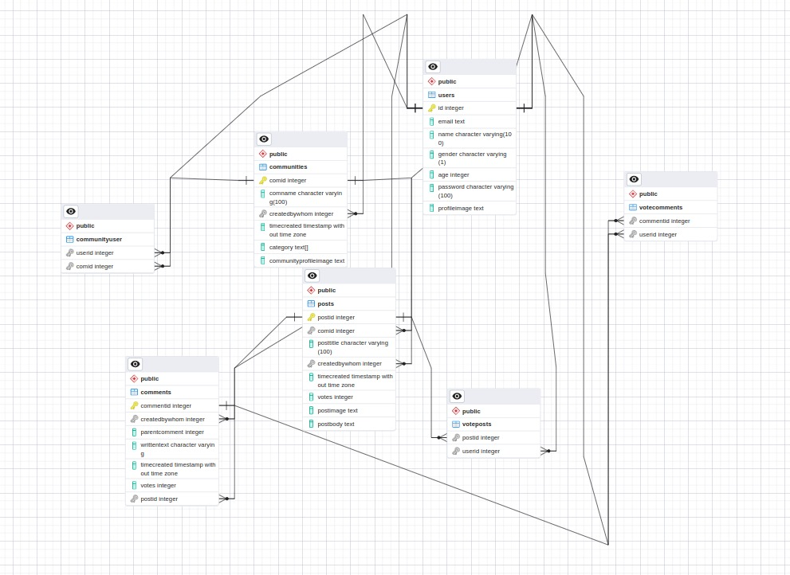

## Table Of Contents
- [Introduction](#1-introduction)
    - [Scope](#11-scope)
    - [Overview](#12-overview)

- [General Description](#2general-description)
    - [Product Perspective](#21-product-perspective)
    - [Tools Used](#22-tools-used)
    - [General Constraints](#23-general-constraints)
    - [Assumptions](#24-assumptions)
    - [Special Design Aspects](#25-special-design-aspects)

- [Design Details](#3-design-details)
    - [Main Design Features](#31-main-design-features)
    - [Application Architecture](#32-application-architecture)
    - [Technology Architecture](#33-technology-architecture)
    - [Deployment Architecture](#34-deployment-architecture)
    - [Standards](#35-standards)
    - [Database Design](#36-database-design)
    - [Interface](#37-interface)
    - [Use case](#38-use-case-diagrams-for-users-and-admin)
    - [Major Classes](#39-major-classes)
    - [Major Modules](#310-major-modules)
    - [Non Functional Attributes](#311-non-functional-attributes)

# 1. Introduction
The purpose of this High Level Design document is to provide a conceptual understanding of the system and its key components, without getting into detailed implementation or technical specifications.

The main purpose is to communicate the system's architecture and design to stakeholders, and other members of the project team. This document serves as a blueprint for the system, outlining its key features, functions, and interactions between different components.

## 1.1 Scope
- System architecture: It provides an overview of the system architecture, including the high-level components, their interactions, and how they work together to achieve the system's goals.
- Functional requirements: It describes the high-level functional requirements of the system, including the features and capabilities that the system must provide.
- Data design: It describes how data will be stored and managed within the system, including data structures, databases, and any relevant data management processes.
- Assumptions and constraints: It includes any assumptions or constraints that may impact the design or implementation of the system.

## 1.2 Overview
The HLD will :-
- Showcase all the high-level design aspects
- Describe the user interface being implemented 
- Describe the hardware and software interfaces
- Include design features and the architecture of the project
- List and describe the non-functional attributes 

***

# 2.General Description

## 2.1 Product Perspective
From a product perspective, the website can be viewed as an online platform that provides users with a variety of tools and features to create, share, and discover content with others in a community-driven environment. The platform allows users to vote on content submissions, with higher-ranked content appearing more prominently on the site.

It also features a variety of communities, or subreddits, that are focused on specific topics or interests. Users can join these communitites to discuss, share, and discover content related to those topics.

From a product perspective, some of the key features and tools that Reddit provides to users include:
- Posting and commenting: Users can create and submit content to the site, and engage in discussions through comments on content submitted by others.
- Voting: Users can upvote or downvote content to indicate their approval or disapproval, and higher-ranked content appears more prominently on the site.
- Communities: Users can join communities focused on specific topics or interests, and engage in discussions and content sharing related to those topics.

Overall, the product's perspective is focused on providing a platform for users to share and discover content, engage in discussions, and connect with others who share their interests. The platform's features and tools are designed to facilitate this community-driven approach to content sharing and discussion.

## 2.2 Tools Used
- ReactJS: A popular open-source JavaScript library used for building user interfaces for web applications.
- NodeJS Server: An open-source, cross-platform, back-end JavaScript runtime environment that runs on the V8 engine and executes JavaScript code outside a web browser.
- More
- More
- More
- More
- More

## 2.3 General Constraints
    To Be Written

## 2.4 Assumptions 
Refer [SRS section](./SRS-Document.md#7-implementation-details)

## 2.5 Special Design Aspects
This application requires internet access for its overall functionality so as to make HTTPS requests to database server and perform methods. 

***

# 3. Design Details

## 3.1 Main Design Features
The main design features include five major parts: application architecture, technology architecture, interfaces, deployment architecture, the database design and use case.

## 3.2 Application Architecture
The architecture depicts the overall high level design view of the project.

## 3.3 Technology Architecture
The architecture depicts the presentation layer, application layer, data layer and cloud layer.

**Presentation Layer** - It is also known as Client layer. Top most layer of an application. t is the layer of the architecture that is responsible for presenting information and data to the user in a way that is visually appealing, easy to understand, and interactive. The presentation layer is typically the front-end of an application, website, or software system, and it provides the user interface through which users can interact with the application.

**Application layer** - It is also known as Business Logic Layer which is also known as logical layer. The application layer is a critical part of technology architecture, particularly in the context of software development. It is responsible for handling the business logic and core functionality of an application or system, and it acts as a bridge between the presentation layer (front-end) and the data layer (back-end).

**Data Layer** - The data is stored in this layer. Application layer communicates with Database layer to retrieve the data. It contains methods that connects the database and performs required action e.g.: insert, update, delete etc. In simple words, it is to share and retrieve the data.

**Cloud Layer** - It refers to the infrastructure and services that enable cloud computing, including hardware, software, networking, and storage resources that are accessed via the internet.
     

## 3.4 Deployment Architecture
A design to depict the deployment process of the entire application.

## 3.5 Standards
- Database – PostgreSQL
- Inputs – Entered through text input layout
- Security – username and password are required for access to the system
- Quality – by keeping the interface simple and direct, quality should be kept at a maximum

## 3.6 Database Design
The diagram depicts entities and the operations to be done on those entities. A good design will minimize redundancy and attempt to store all the information in as small a space as possible.

## 3.7 Interface
Refer [SRS section](./SRS-Document.md#interface-requirements)

## 3.8 Use-Case Diagrams for Users and Admin
The design depicts UML use-case diagrams for both Users and Admin. The diagram has actors and processes assigned to them. We have done separately for both users and admin as one will have app based activity and other web based activity.

User use-case Diagram         |  Admin use case diagram
:-------------------------:|:-------------------------:
  |  

## 3.9 Major Classes  
The design depicts high level design of Classes with their names and their associations. The classes along with their attributes and methods have been explained in the low level design document. Again separate class diagram for users and admins as they both have different servers.

User Class Diagram        |  Admin Class Diagram
:-------------------------:|:-------------------------:
  |  

## 3.10 Major Modules
All the modules have been depicted in the Application Layer of the Technology Architecture. They are:-
- Authentication Module
- Database Management Module
- Posts Module
- Search Module
- Community Module

We have explained all of them separately inside our Low Level Design Document

## 3.11 Non Functional Attributes
**Reliability**: The system will not crash if different users want to post or comment at same time. 
 
**Availability**: The system will run indefinitely. A user can book rooms anytime. However the availability hours of a particular room is controlled by the admin. For new users , requests for access to the app will only be approved during the working hours time.

**Security**: The system will setup as a web platform and the access to the platform is taken care of by the software stack used.

**Maintainability**: The product will be built using modular components that are independent as possible to make it easy for debugging , performance improvement and adaptation to changed environment.

**Portability**: The portability of the project is one of its strengths, as it allows users to access and engage with the platform from virtually anywhere with an internet connection.

***