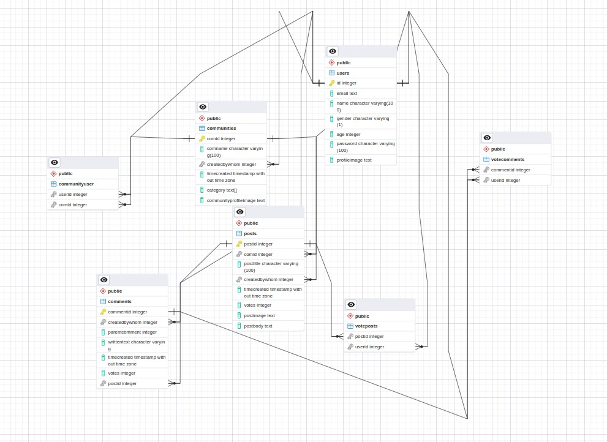
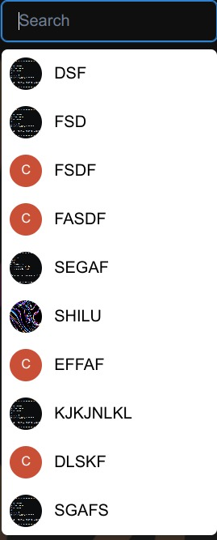

## Table Of Contents
* [Introduction](#1-introduction)
* [Modules](#2-modules)
* [Database Design](#3-database-design)

# 1. Introduction

The purpose of a Low-Level Design (LLD) document is to provide a detailed description of the software design at a lower level of abstraction than the High-Level Design (HLD) document. An LLD document typically includes a more detailed description of each component of the system and how they interact with each other.

The LLD document is typically created after the HLD document, and it serves as a blueprint for the implementation phase of the software development lifecycle. The LLD document provides developers with the detailed information they need to write the code for each component of the system.

***

# 2. Modules
Below are the detailed description of the modules of our application discussed in application layer of technology architecture in high level design document.
- **Authentication Module** - This module contains all the user Authentication related methods like signing up and logging in. The Authentication module works via JWT Tokens. This module will authenticate all the users using the database.. The module will also handle options like editing one’s profile.

- **Database Management Module** - This module will be managed solely by the admin where he will manage database related tasks like adding/deleting/updating a user to the database. Also, the admin can monitor all the activity going on.

</img>

- **Community Module** - The major module of our application. All the community related activities will be handled by this module. The major things handled will be the credibility to post in the community and to comment under a post. All the posts and comments will be maintained in the database.

- **Search Module** - This Module will handle searching among the posts, users and communities according to title of the post, username, community name, tags, and other factors. The module will retrieve information from the database for each query.

      </img>

- **Posts Module** - This Module will be used for the new and existing posts, and the comments on those posts.

***

# 3. Database Design
A database includes bulk information deposited in a framework, making it easier to locate and explore relevant information. A well-designed database contains accurate and up-to-date information, allowing data to be fetched easily whenever needed.
We have implemented a database with minimum redundancy which reduces the probability of faults and discrepancies within the database.
It explains the database ER mentioned in high level design document [here](https://github.com/CS305-software-Engineering/App-for-campus-facility-booking/wiki/High-Level-Design-Document#database-design).
We have created following tables in the database:

Note: All the **Bold** attributes below act as primary key.
<pre>
<b>USER - This collection will contain all the registered users and only these users will be able to login
into the system.</b>
Attributes:
User_Type :             varchar(20)    (student/faculty)
Username:               varchar(20)      
Email:                  string         (Only college Ids have access to app).
<b>Mobile No:</b>              int(10)        [Primary Key]
Encrypted Password:     string         (Auto encrypted by firebase auth).
</pre>

<pre>
<b>CLASSROOMS - This collection will contain all the classrooms that can be booked. These classrooms can be 
booked by users for their use.</b>
Department_Name :       varchar(30) 
<b>Room_Name :</b>             varchar(5)
Capacity :              int(5) 
<b>Slots :</b>                 string
<b>Date</b> :                  DateandTime
Availability_Status :   int(2)           [ 00: Booked  01: Unavailable   : 10: AcadSlots]
</pre>

<pre>
<b>LAB EQUIPMENT - This collection will contain all the lab equipment that can be booked. These lab equipment can be
booked by users for their use.</b>
Attributes:
Department_Name :           varchar(30)   
<b>Lab_Name :</b>                  varchar(20)      
Equipments :                string
<b>Slots :</b>                     string
<b>Date :</b>                      DateandTime
Availability_Status :       int(2)               [ 00: Booked  01: Unavailable   10: AcadSlots]
</pre>

<pre>
<b>SPORTS COMPLEX - This collection will have all the sports complexes that can be booked.</b>
Sport_type :            varchar(30)
<b>Field_name :</b>            varchar(20)
<b>Slots :</b>                 string
<b>Date :</b>                  DateandTime
Availability_Status :   int(2)              [ 00: Booked  01: Unavailable   10: AcadSlots]
</pre>

<pre>
<b>BOOKING RECORD - This collection will have all the bookings made till now through which a particular 
booking can be tracked easily.</b>
<b>Booking_id :</b>              int(11)    
Booked_By :               int(10)            Foreign key referenced to mobile in USER table.
Booked_On :               DateandTime
Booked_Facility_Name :    varchar(20)
Purpose_Of_Booking :      text
Slot_Booked :             string
Date_Booked :             DateandTime
</pre>

<pre>
<b>COURSE RECORD - This collection will have all the details pertaining to the courses being taken.</b>
<b>Course_ID :</b>          varchar(10)
Professor :          varchar(30)
<b>Student_ID :</b>         varchar(10)     Foreign key referenced to username in USER table.
<b>Room_Name :</b>          varchar(5)      Foreign key referenced to room_name in CLASSROOM table.
<b>Slot :</b>               string          (Among one of available slot selected from CLASSROOM table)
<b>Date :</b>               DateandTime
Attedance_Status :   bool            [present/absent]
Semester :           int(5)
Year :               int(10)
</pre>

This database might change to some extent during development process for better performance and for making future integrations to application easier.

***
