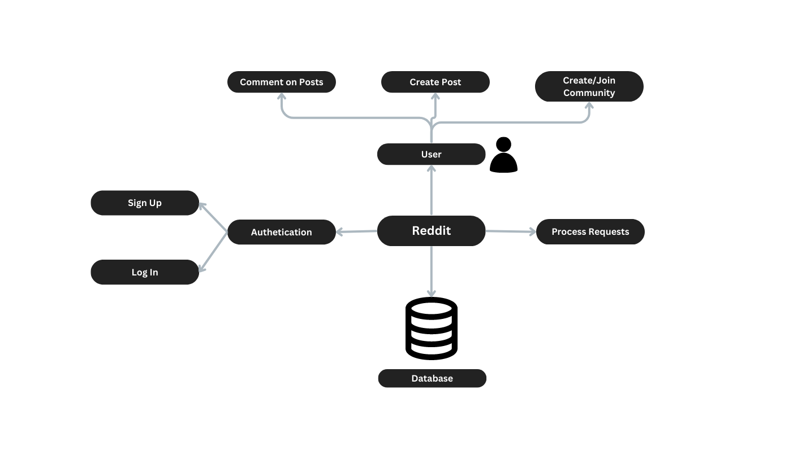
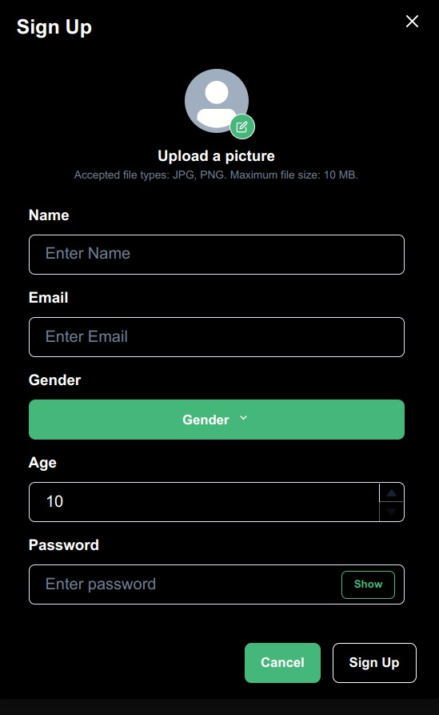
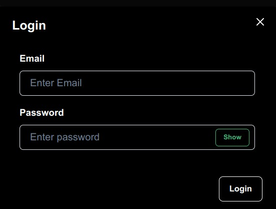
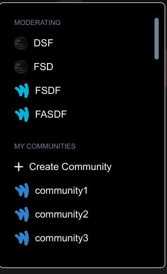
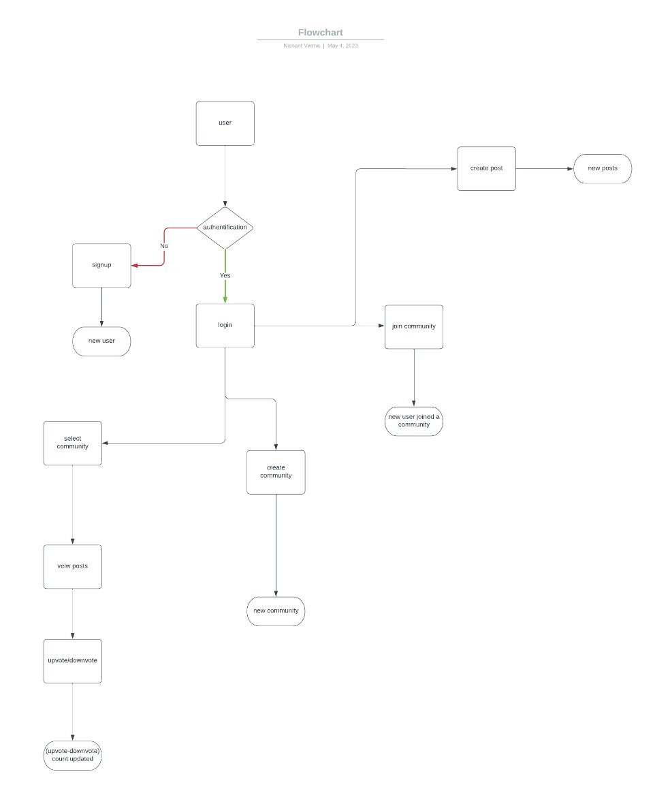

## Table Of Contents
* [Introduction](#1-introduction)
* [Overall Description](#2-overall-description)
* [Block Diagram](#3-block-diagram)
* [Software Stack](#4-software-stack)
* [Features & Requirements](#5-features--requirements)
* [Database Requirements](#6-database-requirements)
* [Implementation Details](#7-implementation-details)
* [Dataflow Diagram](#8-data-flow-diagram)
* [User Description](#9-user-description)
* [Workflow](#10-tasks-workflow)

# 1. Introduction
A Software Requirements Specification (SRS) document is a comprehensive description of the intended purpose, functionality, and behavior of a software system. The primary purpose of an of this document is to provide a detailed and clear description of the software requirements to stakeholders. Requirements described in this document will be used as guidelines to develop the application.

## Project Purpose
The purpose of of this project is to provide the users a platform to share, discuss and discover content on a wide range of topics. It is similar to reddit, a social news aggregation and discussion website where registered members can submit content in the form of text posts, images or direct links. Users can upvote or downvote posts and comments, which determines their visibility on the site, as well as participate in discussions by commenting on posts.

The purpose of of the platform is to provide a space for individuals to share and discuss content and ideas, connect with like-minded individuals, and stay up-to-date on the latest news and trends in various fields, and the platform is driven by user-generated content, which means that the content on the platform is often more diverse and interesting than what is found on traditional news or social media websites.

## Project Scope
Some of the key areas of scope for the project include:
- Discussion: It provides a platform for users to engage in online discussions on a wide range of topics. 
- Content sharing: It allows users to share content in various forms, including text, images, and links. Users can submit their own content or share content from other sources, making it a hub for content discovery and sharing.
- Community building: It is designed to foster the growth of online communities around specific topics or interests.

Overall, the scope of the project is quite broad, as it is designed to be a flexible platform that can accommodate a wide range of interests and activities.

***

# 2. Overall Description 
## Product Perspective
From a product perspective, the website can be viewed as an online platform that provides users with a variety of tools and features to create, share, and discover content with others in a community-driven environment. The platform allows users to vote on content submissions, with higher-ranked content appearing more prominently on the site.

## Product Features
Following Features will be provided by our Product:-
- The platform is organized into communities dedicated to specific topics. Users can subscribe to any community they like and participate in discussions.
- Users can post a wide range of content, including links, images and text posts.
- It has a voting system that allows users to upvote or downvote content based on their opinion of it. 
- Users can comment on posts and engage in discussions with other users. 
- Users can search for specific content, communities, or users using the search function.
- Users can create profiles and customize them with a profile picture.

## User Classes & Characteristics
### Physical Actors → 
*Users* :- All the users can perform the functions provided by the platform.

### System Actors → 
*Admin* :- Allowed to add/delete a post and/or comment.

## Operating Environment
→ It shall operate in any modern web browser.

***

# 3. Block Diagram 

***

# 4. Software Stack
- Web-based portal : ReactJS, NodeJS, Chakra UI
- Database : PostgreSQL
- Authetication : JWT Tokens
***
# 5. Features & Requirements

## System/hardware features

### 1. User Registration
<pre>
• <b>DESCRIPTION & PRIORITY</b>
To use the system, user first registers in the site by filling a simple form, the link of 
which is provided in the home page. 
<b>PRIORITY</b>: High
• <b>STIMULUS & RESPONSE</b>
<b>PRECONDITION</b>: User in homepage, clicked ‘Sign Up’
1. User fills the form and submit
2. Form validation checks to be passed for successful registration
<b>POST CONDITION</b>: The user get their account registered
</pre>

### 2. User Login
<pre>
• <b>DESCRIPTION & PRIORITY</b>
The user login in the login window provided in the homepage.
<b>PRIORITY</b>: High
• <b>STIMULUS & RESPONSE</b>
<b>PRECONDITION</b>: User in homepage, clicked ‘Log In’
1. User fill login form and submit it
2. User login credentials are validated
3. If login info is not correct or all fields are not filled, submission fails and resubmission is required
4. If successfully submitted redirect to dashboard
<b>POST CONDITION</b>: The user get logged in
</pre>

### 3. Search Feature
<pre>
• <b>DESCRIPTION & PRIORITY</b>
User can search for the posts and communities
<b>PRIORITY</b>: Medium
• <b>STIMULUS & RESPONSE</b>
<b>PRECONDITION</b>: User logged in the account
1. User opt to search for something
2. Typing search query provides available options from database
<b>POST CONDITION</b>: user gets the required list of search query
</pre>

### 4. Comment on a Post
<pre>
• <b>DESCRIPTION & PRIORITY</b>
The user wants to comment an exiting post
<b>PRIORITY</b>: High
• <b>STIMULUS & RESPONSE</b>
<b>PRECONDITION</b>: User is logged in
1. User click on the post
2. He types the comment and presses enter
<b>POST CONDITION</b>: The comment is visible to everyone
</pre>

### 5. Create a Community
<pre>
• <b>DESCRIPTION & PRIORITY</b>
    User can create a community
<b>PRIORITY</b>: Medium
• <b>STIMULUS & RESPONSE</b>
<b>PRECONDITION</b>: User is logged in
1. User clicks on the 'Create a Community' Button
2. User fills out the form
3. Confirms the details
<b>POST CONDITION</b>: A new community is created
</pre>

### 6. Create a Post
<pre>
• <b>DESCRIPTION & PRIORITY</b>
    User can create a post
<b>PRIORITY</b>: Medium
• <b>STIMULUS & RESPONSE</b>
<b>PRECONDITION</b>: User is logged in
1. User clicks on the 'Create new post' Button
2. User makes a post
3. Confirms the details
<b>POST CONDITION</b>: A new post is created
</pre>

No specific hardware features and requirements.

## Functional requirements
- User shall be able to view homepage, register and login page
- User shall be able to fill form details
- The database shall be able to insert/update/delete or validate the user credentials
- User shall be able to access web portal via credentials
- Software shall be accessible to the all the users, but joining the communities, posting and commenting shall be available to the registered users only.

## Interface requirements
**User Interfaces** The pages shall permit complete navigation and item selection. Login interface, Register Interface, Homepage, User Profile, Posting interface and Create Community interface.

 

**Hardware Interfaces** No specific hardware interface. The device used to open the software should have internet access.

**Software Interfaces** A modern web browser software is required for web-based portal. 

**Communication Interfaces** The HTTP protocol will be used for communication between server application and client. 

## Software system attributes & Non-functional requirements
System should be secure in terms of user information, user friendly and robust. The system shall provide the right tools to support all its features. The system shall be available to users all the time.

**Reliability**: The system will not crash if different users want to post or comment at same time. 
 
**Availability**: The system will run indefinitely. A user can book rooms anytime. However the availability hours of a particular room is controlled by the admin. For new users , requests for access to the app will only be approved during the working hours time.

**Security**: The system will setup as a web platform and the access to the platform is taken care of by the software stack used.

**Maintainability**: The product will be built using modular components that are independent as possible to make it easy for debugging , performance improvement and adaptation to changed environment.

**Portability**: The portability of the project is one of its strengths, as it allows users to access and engage with the platform from virtually anywhere with an internet connection.

***
# 6. Database Requirements (this section not edited)
Refer [LLD section](./Low-Level-Design-Document.md#4-database-design)

***
# 7. Implementation Details
## Assumptions and Dependencies
- A user can make any number of posts
- Two users can comment at the same time
- A community can have any number of users
- Username for every user in unique
- Posts and comments can be deleted 

***
# 8. Data Flow Diagram

*** 
# 9. User Description
The application will benefit the residenciaries of IIT Ropar to create, share, and discover content with others in a community-driven environment. The platform allows users to vote on content submissions, with higher-ranked content appearing more prominently on the site. All they need to do is to register on the platform and proceed with enjoying its features.
***
